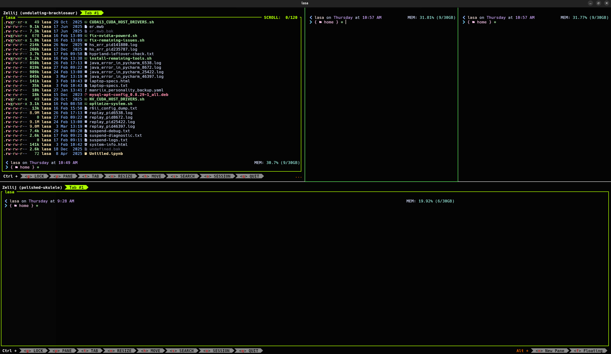
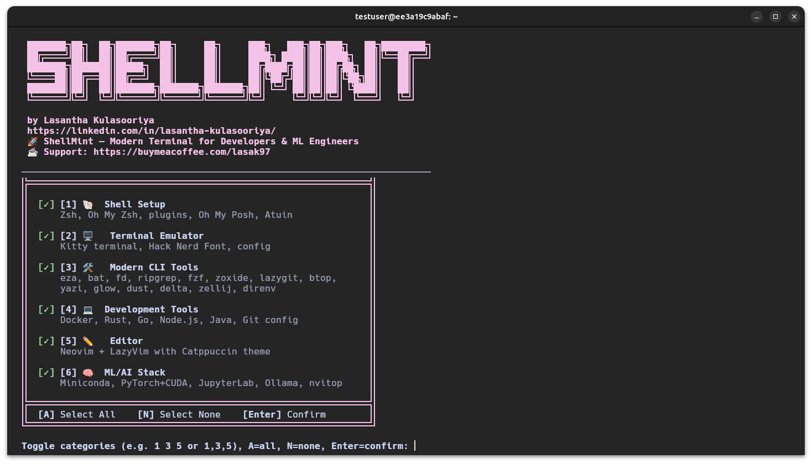
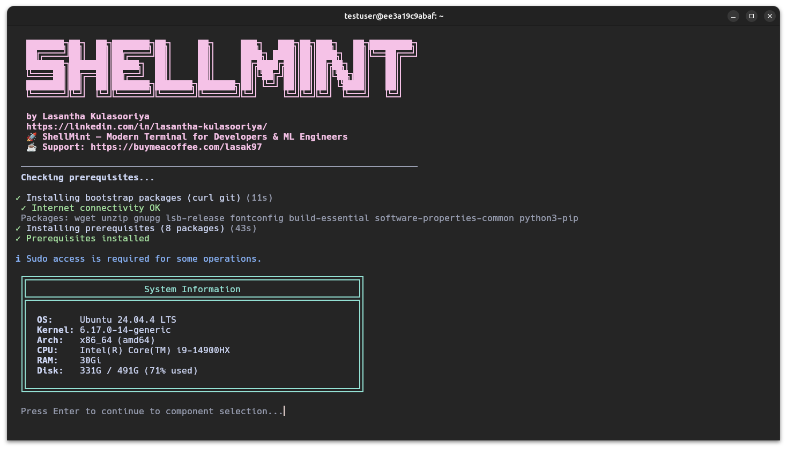
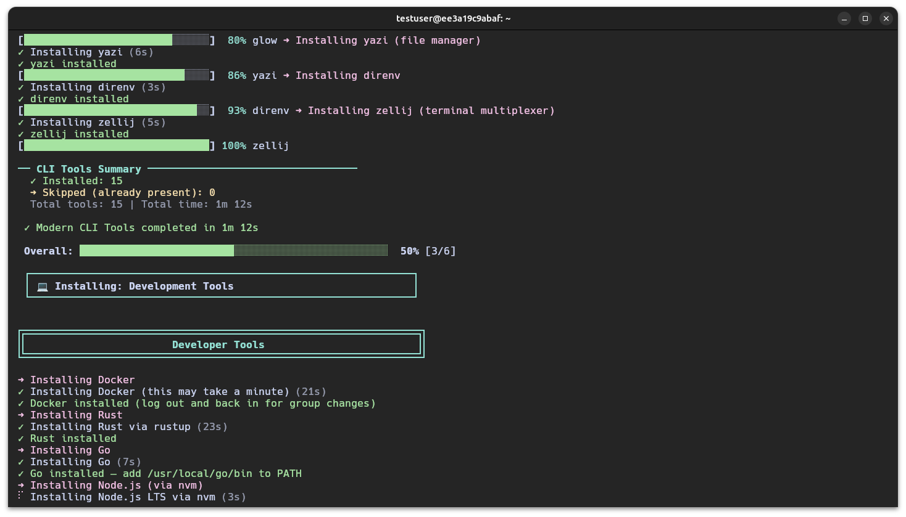
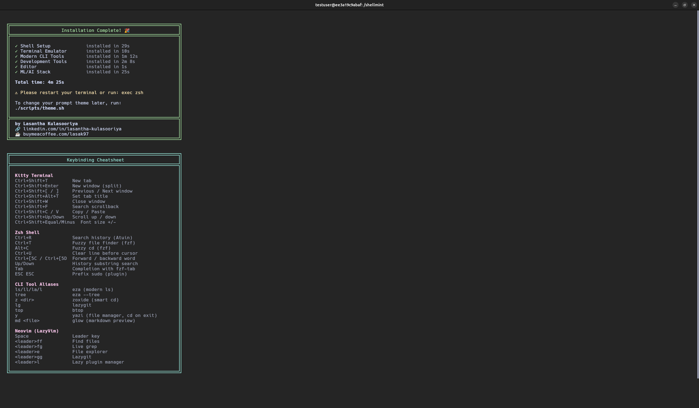

<p align="center">
  
  
  
  
</p>

<h1 align="center">🍃 ShellMint</h1>

<p align="center">
  <strong>A modern, beautiful terminal environment for developers and ML engineers.</strong><br>
  One command to set up a fully configured terminal with 30+ curated tools.
</p>

<p align="center">
  <a href="https://www.linkedin.com/in/lasantha-kulasooriya/">LinkedIn</a> •
  <a href="https://buymeacoffee.com/lasak97">Buy Me a Coffee ☕</a>
</p>

<p align="center">
  
</p>

<table>
  <tr>
    <td align="center" width="50%">
      <br>
      <em>Interactive category selector</em>
    </td>
    <td align="center" width="50%">
      <br>
      <em>System check & prerequisites</em>
    </td>
  </tr>
  <tr>
    <td align="center" width="50%">
      <br>
      <em>Progress bars & spinners</em>
    </td>
    <td align="center" width="50%">
      <br>
      <em>Results & keybinding cheatsheet</em>
    </td>
  </tr>
</table>

---

## Table of Contents

- [What You Get](#what-you-get)
- [Quick Start](#quick-start)
  - [CLI Flags](#cli-flags)
- [Prerequisites](#prerequisites)
- [Changing Your Prompt Theme](#changing-your-prompt-theme)
- [What Each Category Installs](#what-each-category-installs)
  - [Shell Setup](#1-shell-setup)
  - [Terminal Emulator](#2-terminal-emulator)
  - [Modern CLI Tools](#3-modern-cli-tools)
  - [Development Tools](#4-development-tools)
  - [Editor](#5-editor-neovim)
  - [ML/AI Stack](#6-mlai-stack)
- [Version Pinning](#version-pinning)
- [Configuration Files](#configuration-files)
- [Customizing Keybindings](#customizing-keybindings)
- [Shell Aliases Reference](#shell-aliases-reference)
- [Running Individual Categories](#running-individual-categories)
- [Troubleshooting](#troubleshooting)
- [Backups](#backups)
- [Uninstalling](#uninstalling)
- [Contributing](#contributing)
- [Acknowledgments](#acknowledgments)
- [License](#license)

---

## What You Get

| Category | Tools |
|----------|-------|
| **Shell** | Zsh, Oh My Zsh (7 plugins), Oh My Posh prompt, Atuin history |
| **Terminal** | Kitty (GPU-accelerated), Hack Nerd Font |
| **CLI Tools** | eza, bat, fd, ripgrep, fzf, zoxide, lazygit, btop, yazi, glow, dust, delta, zellij, direnv |
| **Dev Tools** | Docker, Rust, Go, Node.js (nvm), Java 17, CMake, Git+Delta config, uv |
| **Editor** | Neovim + LazyVim (Catppuccin theme, LSP, Treesitter) |
| **ML/AI** | Miniconda, PyTorch+CUDA, JupyterLab, Ollama, nvitop |

Everything is themed with **Catppuccin Mocha** — terminal, editor, fzf, bat, git diffs, man pages, and prompt.

## Quick Start

```bash
git clone https://github.com/LasaK97/shellmint.git
cd shellmint
./install.sh
```

The interactive installer will:
1. Show your system information
2. Let you pick which categories to install
3. Install everything with progress bars and spinners
4. Show a summary when done

### CLI Flags

```bash
./install.sh --help                # Show help and available options
./install.sh --version             # Print version
./install.sh --yes                 # Install all components non-interactively
./install.sh --categories 1,3,5   # Install only Shell, CLI Tools, and Editor
./install.sh --skip 6              # Install everything except ML/AI Stack
./install.sh --dry-run             # Preview what would be installed (no changes)
./install.sh --update              # Re-run to update tools to latest versions
./install.sh --configs-only        # Only apply config files (skip tool installation)
./install.sh --verbose             # Show detailed output during installation
```

Flags can be combined: `./install.sh --categories 1,3 --yes` installs Shell and CLI Tools without prompts.

## Prerequisites

- **OS:** Ubuntu 22.04+ or Debian 12+ (x86_64 and aarch64/ARM64)
- **Internet connection** for downloading packages
- **sudo access** (the installer will prompt when needed)
- **~5 GB free disk space** (more if installing ML stack with PyTorch)
- **NVIDIA GPU + CUDA** (optional, only needed for ML/AI stack with GPU support)

The installer automatically installs `curl` and `git` if they're missing. Everything else is handled by the category scripts.

## Changing Your Prompt Theme

The default prompt theme is a custom Catppuccin Mocha theme. To switch to a different [Oh My Posh](https://ohmyposh.dev/) theme:

```bash
./scripts/theme.sh
```

This shows 20 popular themes to choose from. Browse all themes at [ohmyposh.dev/docs/themes](https://ohmyposh.dev/docs/themes).

## What Each Category Installs

### 1. Shell Setup

- [**Zsh**](https://www.zsh.org/) — set as default shell
- [**Oh My Zsh**](https://ohmyz.sh/) — plugin framework with these plugins:
  - [`zsh-autosuggestions`](https://github.com/zsh-users/zsh-autosuggestions) — fish-like suggestions as you type
  - [`fast-syntax-highlighting`](https://github.com/zdharma-continuum/fast-syntax-highlighting) — command syntax coloring
  - [`zsh-history-substring-search`](https://github.com/zsh-users/zsh-history-substring-search) — search history with arrow keys
  - [`zsh-autopair`](https://github.com/hlissner/zsh-autopair) — auto-close brackets and quotes
  - [`zsh-you-should-use`](https://github.com/MichaelAquilina/zsh-you-should-use) — reminds you of aliases you've defined
  - [`zsh-completions`](https://github.com/zsh-users/zsh-completions) — extra completion definitions
  - [`fzf-tab`](https://github.com/Aloxaf/fzf-tab) — fuzzy completion with previews
- [**Oh My Posh**](https://ohmyposh.dev/) — prompt engine with Catppuccin Mocha theme
- [**Atuin**](https://atuin.sh/) — synced, searchable shell history across machines

### 2. Terminal Emulator

- [**Kitty**](https://sw.kovidgoyal.net/kitty/) — GPU-accelerated terminal with:
  - [Hack Nerd Font](https://www.nerdfonts.com/) (icons and ligatures)
  - [Catppuccin Mocha](https://catppuccin.com/) color scheme
  - 85% background opacity
  - Cursor trails
  - Terminator-style split keybindings
  - 50k scrollback with bat as pager

### 3. Modern CLI Tools

Every tool replaces a legacy counterpart with a faster, more user-friendly alternative:

| Tool | Replaces | What it does | Docs |
|------|----------|-------------|------|
| [eza](https://eza.rocks/) | ls | File listing with icons and colors | [Usage](https://eza.rocks/colour/) |
| [bat](https://github.com/sharkdp/bat) | cat | Syntax-highlighted file viewer | [README](https://github.com/sharkdp/bat#readme) |
| [fd](https://github.com/sharkdp/fd) | find | Fast file finder | [Usage](https://github.com/sharkdp/fd#usage) |
| [ripgrep](https://github.com/BurntSushi/ripgrep) | grep | Fast content search | [Guide](https://github.com/BurntSushi/ripgrep/blob/master/GUIDE.md) |
| [fzf](https://github.com/junegunn/fzf) | — | Fuzzy finder for everything | [Examples](https://github.com/junegunn/fzf#usage) |
| [zoxide](https://github.com/ajeetdsouza/zoxide) | cd | Smart directory jumping | [README](https://github.com/ajeetdsouza/zoxide#readme) |
| [lazygit](https://github.com/jesseduffield/lazygit) | git CLI | Git TUI | [Keybindings](https://github.com/jesseduffield/lazygit/blob/master/docs/keybindings/Keybindings_en.md) |
| [btop](https://github.com/aristocratos/btop) | top/htop | System monitor | [README](https://github.com/aristocratos/btop#readme) |
| [yazi](https://yazi-rs.github.io/) | ranger | Terminal file manager | [Docs](https://yazi-rs.github.io/docs/installation) |
| [glow](https://github.com/charmbracelet/glow) | — | Markdown viewer | [README](https://github.com/charmbracelet/glow#readme) |
| [dust](https://github.com/bootandy/dust) | du | Disk usage viewer | [README](https://github.com/bootandy/dust#readme) |
| [delta](https://dandavison.github.io/delta/) | diff | Beautiful git diffs | [Manual](https://dandavison.github.io/delta/introduction.html) |
| [zellij](https://zellij.dev/) | tmux | Terminal multiplexer | [Docs](https://zellij.dev/documentation/) |
| [direnv](https://direnv.net/) | — | Per-directory env variables | [Docs](https://direnv.net/#getting-started) |

### 4. Development Tools

- [**Docker**](https://docs.docker.com/) — containerization (with docker compose plugin)
- [**Rust**](https://www.rust-lang.org/learn) — via [rustup](https://rustup.rs/)
- [**Go**](https://go.dev/doc/) — latest version
- [**Node.js**](https://nodejs.org/en/docs) — via [nvm](https://github.com/nvm-sh/nvm) (LTS version)
- [**Java**](https://openjdk.org/) — OpenJDK 17
- [**CMake**](https://cmake.org/documentation/) — build system
- [**Git**](https://git-scm.com/doc) — configured with [delta](https://dandavison.github.io/delta/) as diff viewer (side-by-side, line numbers, Catppuccin theme)
- [**uv**](https://docs.astral.sh/uv/) — fast Python package/project manager (replaces pip, pipx, virtualenv)

### 5. Editor (Neovim)

- [**Neovim**](https://neovim.io/doc/) — latest stable AppImage
- [**LazyVim**](https://www.lazyvim.org/) — pre-configured IDE layer with:
  - [Catppuccin Mocha](https://github.com/catppuccin/nvim) theme (transparent background)
  - LSP support for Python, JSON, YAML, Markdown, Docker, Rust
  - [Treesitter](https://github.com/nvim-treesitter/nvim-treesitter) syntax highlighting
  - [Telescope](https://github.com/nvim-telescope/telescope.nvim) fuzzy finder
  - [render-markdown.nvim](https://github.com/MeanderingProgrammer/render-markdown.nvim) for beautiful markdown
  - [smear-cursor.nvim](https://github.com/sphamba/smear-cursor.nvim) for cursor animations

### 6. ML/AI Stack

Sets up the ML infrastructure. Project-specific libraries (transformers, pandas, scikit-learn, etc.) should be installed per-project in their own conda environments.

- [**Miniconda**](https://docs.anaconda.com/miniconda/) — Python environment manager
- [**PyTorch**](https://pytorch.org/docs/stable/) — with automatic CUDA detection (installed in a base `ml` conda env)
- [**JupyterLab**](https://jupyterlab.readthedocs.io/) — interactive notebooks (installed in the `ml` conda env)
- [**Ollama**](https://ollama.com/) — local LLM inference
- [**nvitop**](https://github.com/XuehaiPan/nvitop) — GPU monitoring TUI

## Version Pinning

Tool versions are defined in `tool-versions.conf`. The installer tries to fetch the latest release from GitHub first and falls back to these pinned versions if the API is unreachable or rate-limited.

To pin a specific version, edit the file:

```bash
# tool-versions.conf
LAZYGIT_VERSION="0.44.1"
DELTA_VERSION="0.18.2"
NEOVIM_VERSION="stable"      # or a tag like "0.10.4"
GO_VERSION="go1.24.1"        # include the "go" prefix
NODE_LTS_VERSION="22"
```

## Configuration Files

All configs live in the `configs/` directory:

```
configs/
├── .zshrc              # Shell config (aliases, plugins, options)
├── .zshenv             # Shell environment (cargo, compinit skip)
├── kitty/
│   └── kitty.conf      # Terminal config (font, colors, keybindings)
├── nvim/
│   ├── init.lua         # LazyVim setup with Catppuccin
│   ├── lazyvim.json     # LazyVim metadata
│   └── lua/plugins/
│       ├── init.lua     # Custom plugins (smear-cursor)
│       └── markdown.lua # Markdown rendering config
├── oh-my-posh/
│   └── theme.omp.json  # Prompt theme (Catppuccin Mocha)
└── git/
    └── .gitconfig-delta # Git delta diff configuration
```

## Customizing Keybindings

### Kitty Terminal Keybindings

Edit `~/.config/kitty/kitty.conf`. The default keybindings follow Terminator-style:

| Shortcut | Action |
|----------|--------|
| `Ctrl+Shift+O` | Split horizontally |
| `Ctrl+Shift+E` | Split vertically |
| `Ctrl+Shift+W` | Close split |
| `Ctrl+Shift+]` / `[` | Next / previous split |
| `Alt+Arrow` | Navigate between splits |
| `Ctrl+Arrow` | Resize split |
| `Ctrl+Shift+T` | New tab |
| `Ctrl+Shift+Q` | Close tab |
| `Ctrl+Shift+Right/Left` | Next / previous tab |
| `Ctrl+L` | Clear screen + scrollback |

To change a keybinding, find the `map` line and modify it:

```conf
# Example: change split horizontal from Ctrl+Shift+O to Ctrl+Shift+H
map ctrl+shift+h launch --location=hsplit --cwd=current
```

See all available actions in the [Kitty keybinding docs](https://sw.kovidgoyal.net/kitty/actions/).

### Zsh Keybindings

Edit `~/.zshrc` under the `Key Bindings` section:

| Shortcut | Action |
|----------|--------|
| `Ctrl+U` | Delete line before cursor |
| `Ctrl+5+C` / `Ctrl+5+D` | Forward / backward word |
| `Up/Down Arrow` | History substring search |
| `Shift+Tab` | Undo |
| `Space` | Magic space (expand history) |

To add a custom keybinding:

```zsh
# Example: Ctrl+F to open fzf file finder
bindkey '^F' fzf-file-widget
```

See the [Zsh Line Editor docs](https://zsh.sourceforge.io/Doc/Release/Zsh-Line-Editor.html) for all available widgets.

### Neovim Keybindings

LazyVim uses `Space` as the leader key. Press `Space` and wait to see all available commands. Edit `~/.config/nvim/lua/plugins/init.lua` to add custom keymaps:

```lua
return {
  {
    "LazyVim/LazyVim",
    keys = {
      { "<leader>xx", "<cmd>YourCommand<cr>", desc = "Your description" },
    },
  },
}
```

See all defaults: press `Space` in Neovim, or visit [LazyVim keymaps](https://www.lazyvim.org/keymaps).

## Shell Aliases Reference

| Alias | Command | Description |
|-------|---------|-------------|
| `ls` | `eza --icons` | List with icons |
| `ll` | `eza -la --icons` | Detailed list |
| `tree` | `eza --tree --icons` | Tree view |
| `lt` | `eza -la --sort=modified` | Sort by modified |
| `vi` / `vim` | `nvim` | Neovim |
| `lg` | `lazygit` | Git TUI |
| `top` | `btop` | System monitor |
| `md` | `glow` | Markdown viewer |
| `dus` | `dust` | Disk usage |
| `ddiff` | `delta` | Diff viewer |
| `nv` | `watch nvidia-smi` | GPU monitoring |
| `nvtop` | `nvitop` | GPU TUI |
| `y` | `yazi` (function) | File manager (cd on exit) |
| `..` / `...` / `....` | `cd ..` / `../..` / `../../..` | Navigation |
| `update` | `apt update && upgrade` | System update |

## Running Individual Categories

Each category can be installed independently:

```bash
./scripts/shell.sh      # Shell setup only
./scripts/terminal.sh   # Terminal only
./scripts/cli-tools.sh  # CLI tools only
./scripts/dev-tools.sh  # Dev tools only
./scripts/editor.sh     # Editor only
./scripts/ml-tools.sh   # ML stack only
./scripts/theme.sh      # Change prompt theme
```

## Troubleshooting

### Icons not rendering correctly

You need a [Nerd Font](https://www.nerdfonts.com/) installed and selected in your terminal. The installer installs **Hack Nerd Font** automatically. If icons still don't render:

1. Make sure your terminal is using `Hack Nerd Font Mono` as the font
2. Restart your terminal completely (not just open a new tab)
3. Verify the font is installed: `fc-list | grep -i "hack.*nerd"`

### Oh My Posh prompt not showing

The prompt is cached for performance. If it doesn't appear after installation:

```bash
rm ~/.cache/oh-my-posh-init.zsh
exec zsh
```

### CUDA not detected by PyTorch

1. Check that NVIDIA drivers are installed: `nvidia-smi`
2. Check CUDA toolkit: `nvcc --version`
3. Verify PyTorch sees your GPU:
   ```bash
   conda activate ml
   python -c "import torch; print(torch.cuda.is_available())"
   ```
4. If `False`, you may need to install the matching CUDA toolkit version. See the [PyTorch installation guide](https://pytorch.org/get-started/locally/).

### flash-attn fails to build

flash-attn is not installed by ShellMint but is commonly needed for ML work. It requires a CUDA toolkit matching your PyTorch installation. Common fixes:

1. Ensure `nvcc --version` matches the CUDA version PyTorch was built with
2. Install build dependencies: `sudo apt install build-essential python3-dev`
3. Try installing with a specific version: `pip install flash-attn==2.8.3 --no-build-isolation`
4. See the [flash-attn installation guide](https://github.com/Dao-AILab/flash-attention#installation-and-features).

### Kitty not launching or showing black screen

1. Check if your GPU driver supports OpenGL: `glxinfo | grep "OpenGL version"`
2. Try disabling GPU rendering: add `linux_display_server x11` to `kitty.conf`
3. See [Kitty FAQ](https://sw.kovidgoyal.net/kitty/faq/)

### Zsh plugins not loading

If plugins aren't working after install:

1. Make sure Oh My Zsh is installed: `ls ~/.oh-my-zsh`
2. Check plugins are cloned: `ls ~/.oh-my-zsh/custom/plugins/`
3. Re-source your config: `exec zsh`
4. Missing plugin? Clone it manually:
   ```bash
   git clone https://github.com/zsh-users/zsh-autosuggestions ~/.oh-my-zsh/custom/plugins/zsh-autosuggestions
   ```

### Neovim shows errors on first launch

This is normal. LazyVim downloads and compiles plugins on the first run. Wait for it to finish (you'll see progress in the statusline), then restart Neovim. If errors persist, run `:checkhealth` inside Neovim to diagnose.

### Behind a proxy or corporate firewall

If downloads fail or time out, set your proxy environment variables before running the installer:

```bash
export http_proxy="http://proxy.example.com:8080"
export https_proxy="http://proxy.example.com:8080"
export no_proxy="localhost,127.0.0.1"
./install.sh
```

If GitHub API calls are rate-limited (e.g., behind a shared IP), the installer falls back to known-good versions automatically.

### "Permission denied" during installation

The installer needs `sudo` for system-level packages (apt, docker, etc.). If you see permission errors:

1. Make sure you're NOT running the script as root — run as your normal user
2. Ensure your user is in the `sudo` group: `groups $USER`
3. If using WSL, some operations may need additional configuration

## Backups

The installer automatically backs up existing config files before overwriting:

```
~/.zshrc.backup.20260305_143022
~/.config/kitty/kitty.conf.backup.20260305_143022
~/.config/nvim.backup.20260305_143022/
```

To restore a backup, simply copy it back:

```bash
cp ~/.zshrc.backup.20260305_143022 ~/.zshrc
```

## Logs

Installation output is logged to `~/.shellmint-install.log` for troubleshooting.

## Uninstalling

ShellMint includes a selective uninstaller:

```bash
./uninstall.sh                    # Interactive — choose what to remove
./uninstall.sh --all              # Select all categories, with per-category prompts
./uninstall.sh --all --yes        # Remove everything non-interactively
./uninstall.sh --configs-only     # Only restore backed-up configs (keep tools)
```

The uninstaller lets you choose per category whether to:
- **Full remove** — uninstall tools and restore config backups
- **Configs only** — restore backed-up configs but keep tools installed
- **Skip** — leave that category untouched

Uninstall log is saved to `~/.shellmint-uninstall.log`.

## Tested On

| Distro | Version | Arch | Status |
|--------|---------|------|--------|
| Ubuntu | 24.04 LTS (Noble) | x86_64 | ✅ Tested |
| Ubuntu | 22.04 LTS (Jammy) | x86_64 | ✅ Tested |
| Debian | 12 (Bookworm) | x86_64 | ✅ Tested |
| Linux Mint | 22 | x86_64 | ✅ Tested |
| Pop!_OS | 22.04 / 24.04 | x86_64 | ✅ Expected |

## Contributing

Contributions are welcome! Feel free to:
- Add support for more distros (Fedora, Arch)
- Add new tool categories
- Improve the installer UI
- Fix bugs

## Acknowledgments

This setup is built on top of amazing open-source projects:

- [Catppuccin](https://catppuccin.com/) — the beautiful pastel theme used across all tools
- [Oh My Zsh](https://ohmyz.sh/) — the Zsh framework that makes shell configuration enjoyable
- [Oh My Posh](https://ohmyposh.dev/) — the cross-shell prompt engine
- [LazyVim](https://www.lazyvim.org/) — the Neovim distribution that makes Neovim an IDE
- [Kitty](https://sw.kovidgoyal.net/kitty/) — the GPU-accelerated terminal
- All the CLI tool authors who make terminal life better

## License

MIT License — see [LICENSE](LICENSE) for details.

---

<p align="center">
  Made with ❤️ by <a href="https://www.linkedin.com/in/lasantha-kulasooriya/">Lasantha Kulasooriya</a><br>
  <a href="https://buymeacoffee.com/lasak97">☕ Buy me a coffee</a> if this saved you time!
</p>
